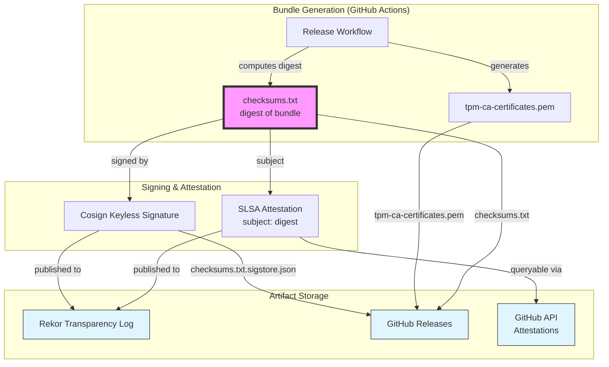
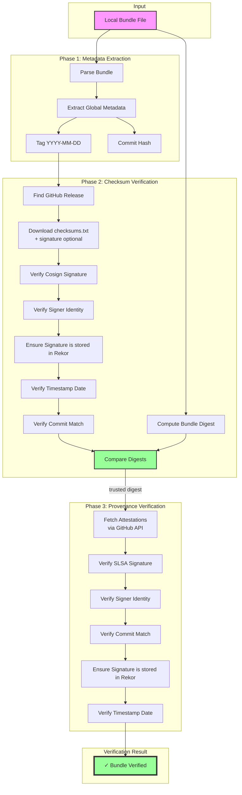

# Bundle Verification Specification

## Document History

| Version |    Date    |   Author    |   Description    |
|---------|------------|-------------|------------------|
| alpha   | 2025-12-05 | Loïc Sikidi | Initial version  |

## Overview

This specification describes the complete verification process for TPM Trust Bundles, ensuring both **integrity** (the bundle hasn't been tampered with) and **provenance** (the bundle was generated by the correct workflow from the expected repository state).

The verification process relies on two complementary mechanisms:
1. **Cosign signature verification** - Validates checksum integrity using keyless signatures
2. **GitHub Attestation verification** - Validates build provenance through SLSA attestations

## Trust Anchor

The **checksum integrity** is our trust anchor. All verification flows ultimately validate that:
1. The checksum is authentic (signed by the correct GitHub Actions workflow)
2. The bundle matches the verified checksum
3. The build provenance can be trusted through the verified digest

## Bundle Publication Flow

The following diagram illustrates how bundles are generated, signed, and published:



### Publication Steps

1. **Bundle Generation**: GitHub Actions workflow generates the TPM trust bundle
2. **Checksum Computation**: Digest is computed for the bundle
3. **Cosign Signature**: The checksum is signed using Cosign with keyless signature
   - Signature is published to Rekor transparency log
   - Signature bundle (`checksums.txt.sigstore.json`) is uploaded to GitHub Releases
4. **SLSA Attestation**: GitHub's `attest-build-provenance` action creates a SLSA attestation
   - **Important**: The action receives only the checksum, not the bundle file
   - The checksum becomes a Subject in the SLSA attestation
   - Attestation is signed with keyless signature and published to Rekor
   - Attestation is queryable via GitHub API using the artifact digest
5. **Release Publication**: All artifacts are published to GitHub Releases
   - `tpm-ca-certificates.pem` (the bundle)
   - `checksums.txt` (digest of the bundle)
   - `checksums.txt.sigstore.json` (Cosign signature bundle)


> [!NOTE]
> For now SHA256 MUST be used to compute the digest, it could change in the future if SHA256 is no longer considered secure.

## Bundle Verification Flow

The following diagram illustrates the verification process:



### Verification Steps

#### Phase 1: Metadata Extraction

1. **Parse Bundle**: Extract global metadata from the bundle file (see [Bundle Format](04-tpm-trust-bundle-format.md))
2. **Extract Tag**: Obtain the bundle generation date in `YYYY-MM-DD` format
3. **Extract Commit**: Obtain the Git commit hash (40-character hex string)

#### Phase 2: Checksum Verification (Cosign)

1. **Find GitHub Release**: Use the tag to locate the corresponding GitHub Release
2. **Download Artifacts** (optional): Download `checksums.txt` and `checksums.txt.sigstore.json` if not provided locally
3. **Compute Bundle Digest**: Calculate digest of the local bundle file
4. **Verify Cosign Signature**:
   - Load the Sigstore bundle from `checksums.txt.sigstore.json`
   - **Verify Signer Identity** (keyless signature validation):
     - Check certificate's `Issuer` matches GitHub Actions OIDC issuer
     - Check certificate's `Subject` matches expected workflow identity
     - Check certificate's `SourceRepositoryURI` matches expected repository
     - Check certificate's `SourceRepositoryRef` matches expected tag
   - **Verify Rekor Entry**: Ensure signature was recorded in Rekor transparency log
   - **Verify Commit Match**: Extract `SourceRepositoryDigest` from certificate and compare with expected commit hash
5. **Verify Timestamp Date**: Extract Rekor timestamp and verify it matches the bundle's date tag (YYYY-MM-DD)
6. **Compare Digests**: Verify that the computed digest matches the verified checksum

**At this point, the bundle digest is trusted and can be used for provenance verification.**

#### Phase 3: Provenance Verification (SLSA Attestation)

1. **Fetch Attestations**: Query GitHub API for attestations associated with the trusted digest
2. **Verify SLSA Signature**: For each attestation:
   - Load the Sigstore bundle from the attestation
   - Verify the signature
   - **Verify Signer Identity** (same checks as Cosign):
     - Check certificate's `Issuer`, `Subject`, `SourceRepositoryURI`, `SourceRepositoryRef`
   - **Verify Rekor Entry**: Ensure attestation was recorded in Rekor transparency log
3. **Verify Commit Match**: Extract git commit from attestation's `buildDefinition.resolvedDependencies[0].digest.gitCommit` and compare with expected commit
4. **Verify Timestamp Date**: Extract Rekor timestamp and verify it matches the bundle's date tag (YYYY-MM-DD)

**All verifications must pass for the bundle to be considered valid.**

## Verification Policy

The verification process enforces the following policy requirements:

### Identity Requirements (Keyless Signatures)

Both Cosign and SLSA attestation signatures must satisfy:

| Certificate Field | Expected Value |
|-------------------|----------------|
| `Issuer` | `https://token.actions.githubusercontent.com` |
| `Subject` | `https://github.com/{owner}/{repo}/.github/workflows/{workflow}@{ref}` |
| `SourceRepositoryURI` | `https://github.com/{owner}/{repo}` |
| `SourceRepositoryRef` | `refs/tags/{date}` (YYYY-MM-DD format) |
| `SourceRepositoryDigest` | Expected Git commit hash (40-char hex) |

### Transparency Log Requirements

All signatures must be recorded in Rekor transparency log with verifiable timestamps.

### Metadata Consistency

The following values must be consistent across all verification steps:
- **Date/Tag**: Bundle metadata, GitHub Release tag, certificate `SourceRepositoryRef`, Rekor timestamp date
- **Commit**: Bundle metadata, certificate `SourceRepositoryDigest`, SLSA attestation `gitCommit`

> [!NOTE]
> These additional checks ensure that the global metadata is TRUTHFUL by verifying:
> 1. The release was actually produced at the indicated date (no falsification of timestamps)
> 2. The commit matches exactly what is indicated in the metadata (ensuring build reproducibility)

## Implementation Notes

### Default Behavior

When verifying a bundle:
1. **Auto-detection**: If checksum files are not provided, the verifier follows this fallback strategy:
   - First, automatically looks for `checksums.txt` and `checksums.txt.sigstore.json` in the same directory as the bundle
   - If not found locally, automatically downloads them from the GitHub release matching the bundle's date tag
   - Downloaded files are automatically cleaned up after verification
2. **Hash Algorithm**: SHA256 is used by default (not specified in bundle metadata)
3. **Repository**: Defaults to the official `loicsikidi/tpm-ca-certificates` repository

### Error Handling

The verifier must fail if:
- Bundle metadata is missing or malformed
- Checksum files cannot be found or accessed
- Cosign signature verification fails
- Rekor entry cannot be verified
- Signer identity doesn't match expected values
- Computed digest doesn't match verified checksum
- No attestations are found for the artifact
- Attestation verification fails
- Commit hash mismatch between bundle metadata and signatures
- Timestamp date doesn't match bundle tag

### CLI Example

```bash
# Automatic verification (auto-detects checksums)
tpmtb bundle verify tpm-ca-certificates.pem

# Explicit checksum files
tpmtb bundle verify tpm-ca-certificates.pem \
  --checksums-file checksums.txt \
  --checksums-signature checksums.txt.sigstore.json

# Override metadata (useful for testing or when metadata is missing)
tpmtb bundle verify tpm-ca-certificates.pem \
  --date 2024-06-15 \
  --commit a1b2c3d4e5f67890123456789abcdef012345678
```

## Security Considerations

1. **Keyless Signatures**: Using GitHub Actions OIDC tokens eliminates the need for long-lived signing keys, reducing key compromise risks
2. **Transparency Logs**: Rekor ensures all signatures are publicly auditable and timestamped
3. **Dual Verification**: Both Cosign (integrity) and SLSA (provenance) must pass, providing defense in depth
4. **Commit Anchoring**: Verifying the exact Git commit ensures reproducibility and auditability
5. **No Direct File Access**: The SLSA attestation action only receives checksums, never the actual bundle file, limiting potential attack surface
