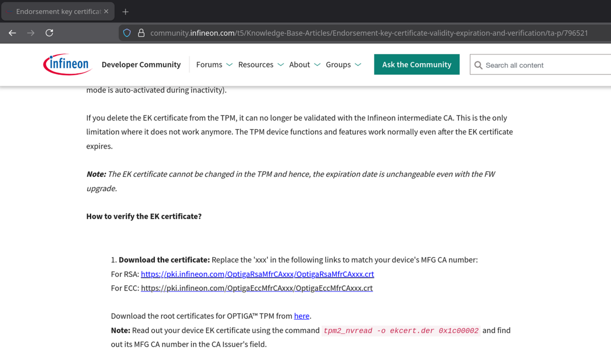

# Infineon Technologies (IFX) TPM Root Certificates

## Overview

Only one root certificate is clearly identified in Infineon's official documentation: **Infineon OPTIGA(TM) ECC Root CA**.

However, further exploration of various resources provided by Infineon revealed the existence of additional root certificates.

This turned out to be a real treasure hunt!

> [!NOTE]
> According to [this community forum post](https://community.infineon.com/t5/OPTIGA-TPM/intermediate-CA-of-SLB9670XQ20FW786XTMA1/td-p/1121360), the new version of Infineon's website appears to have removed some TPM certificate information. Support indicates that this information will be reintegrated in a future website update (without committing to a specific date).

## Certificate Inventory

| Certificate Name | Type | Source | Does the source reference a fingerprint? |
|-----------------|------|--------|------------------------------------------|
| Infineon OPTIGA(TM) ECC Root CA | Root | Official documentation | No |
| Infineon OPTIGA(TM) RSA Root CA | Root | PKI endpoint discovery | No |
| Infineon OPTIGA(TM) ECC Root CA 2 | Root | GitHub repository + PKI endpoint | No |
| Infineon OPTIGA(TM) RSA Root CA 2 | Root | GitHub repository + PKI endpoint | No |
| Infineon OPTIGA(TM) ECC Root CA 3 | Root | PKI endpoint discovery | No |
| Infineon OPTIGA(TM) RSA Root CA 3 | Root | PKI endpoint discovery | No |
| Infineon OPTIGA(TM) ECC Manufacturing CA 000 to 036 | Intermediate | Official documentation | No |
| Infineon OPTIGA(TM) RSA Manufacturing CA 000 to 036 | Intermediate | Official documentation | No |
| Infineon OPTIGA(TM) TPM 2.0 ECC CA 037 to 078 | Intermediate | Official documentation | No |
| Infineon OPTIGA(TM) TPM 2.0 RSA CA 037 to 078 | Intermediate | Official documentation | No |

## Discovery Process

### Infineon OPTIGA(TM) ECC Root CA

**Source**: Infineon's official documentation
- **Web Page**: https://www.infineon.com/design-resources/platforms/optiga-software-tools/optiga-tpm-certificates/optiga-trust-certificates
- **Screenshot Reference**: 

### Infineon OPTIGA(TM) RSA Root CA

**Discovery Method**:
1. While browsing Infineon's TPM product list ([here](https://www.infineon.com/products/security-smart-card-solutions/optiga-embedded-security-solutions/optiga-tpm)), I noticed references to intermediate certificates signed by an RSA root certificate.
   * 
2. Screenshot from the TPM 2.0 product page:
   * 
3. I downloaded the certificate and examined its content for references to a root certificate.
4. I found a reference to `http://pki.infineon.com/OptigaRsaRootCA/OptigaRsaRootCA.crt`
5. I tested whether the endpoint was accessible via HTTPS and success!

Since the domain **pki.infineon.com** is owned by Infineon Technologies AG, we can reasonably assume this certificate is legitimate.

**URL**: https://pki.infineon.com/OptigaRsaRootCA/OptigaRsaRootCA.crt

### Infineon OPTIGA(TM) ECC Root CA 2 + RSA Root CA 2

**Discovery Method**:
1. While exploring the documentation, I found the [OPTIGA™ Trust M configurations](infineon-optiga-trust-m-configguide-productfamilyoverview-en.pdf) document which mentions the existence of **Infineon OPTIGA™ ECC Root CA 2** on page 5.
  
2. I found the [optiga-trust-m-overview](https://github.com/Infineon/optiga-trust-m-overview) repository owned by Infineon, which contains several DER-format certificates in the [certs](https://github.com/Infineon/optiga-trust-m-overview/tree/main/data/certificates) directory.
3. The directory contains intermediate certificates that reference the PKI to retrieve root certificates.

Since the domain **pki.infineon.com** is owned by Infineon Technologies AG, we can reasonably assume these certificates are legitimate.

> [!NOTE]
> I created a fork of the repository in case it gets removed in the future: [here](https://github.com/loicsikidi/optiga-trust-m-overview)

**URLs**:
- ECC Root CA 2: https://pki.infineon.com/OptigaEccRootCA2/OptigaEccRootCA2.crt
- RSA Root CA 2: https://pki.infineon.com/OptigaRsaRootCA2/OptigaRsaRootCA2.crt

### Infineon OPTIGA(TM) ECC Root CA 3 + RSA Root CA 3

**Discovery Method**:
1. Out of curiosity, I tested whether version 3 of Infineon's ECC and RSA root certificates existed.
2. By modifying the URLs from the previous certificates, I was able to access the following certificates:
   * ECC Root CA 3: https://pki.infineon.com/OptigaEccRootCA3/OptigaEccRootCA3.crt
   * RSA Root CA 3: https://pki.infineon.com/OptigaRsaRootCA3/OptigaRsaRootCA3.crt

Since the domain `pki.infineon.com` is owned by Infineon Technologies AG, we can reasonably assume these certificates are legitimate.

**URLs**:
- ECC Root CA 3: https://pki.infineon.com/OptigaEccRootCA3/OptigaEccRootCA3.crt
- RSA Root CA 3: https://pki.infineon.com/OptigaRsaRootCA3/OptigaRsaRootCA3.crt

### Intermediate Certificates

[Endorsement key certificate – validity expiration and verification](https://community.infineon.com/t5/Knowledge-Base-Articles/Endorsement-key-certificate-validity-expiration-and-verification/ta-p/796521) article references the URLs from the PKI in order to download the intermediate certificates.

**URLs**:
- For RSA: `https://pki.infineon.com/OptigaRsaMfrCAxxx/OptigaRsaMfrCAxxx.crt`
- For ECC: `https://pki.infineon.com/OptigaEccMfrCAxxx/OptigaEccMfrCAxxx.crt`

> [!NOTE]
> `xxx` is the MFG CA number

- **Screenshot Reference**: 

---

https://community.infineon.com/t5/Knowledge-Base-Articles/Endorsement-key-certificate-validity-expiration-and-verification/ta-p/796521
https://community.infineon.com/t5/OPTIGA-TPM/intermediate-CA-of-SLB9670XQ20FW786XTMA1/td-p/1121360
