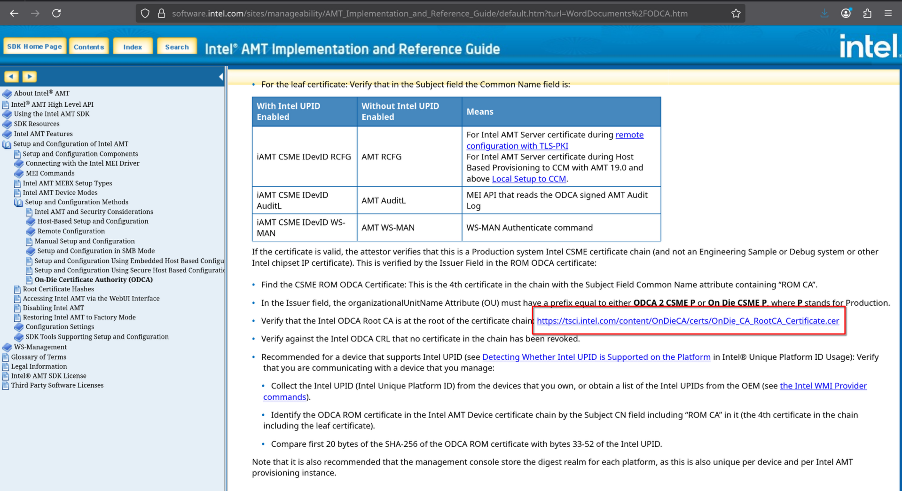

# Intel (INTC)

## Certificate Inventory

| Certificate Name | Type | Source Document | Does the source references a fingerprint? |
|-----------------|------|-----------------|:-----------------:|
| OnDie CA RootCA | Root | Intel AMT Implementation and Reference Guide | No |

### Source Information

The certificate details were retrieved from Intel's official documentation:
- **Web Page**: https://software.intel.com/sites/manageability/AMT_Implementation_and_Reference_Guide/default.htm?turl=WordDocuments%2FODCA.htm
- **Screenshot Reference**: 

The documentation references the Intel ODCA (On-Die Certificate Authority) Root CA certificate, which is used to verify Intel AMT certificates.
