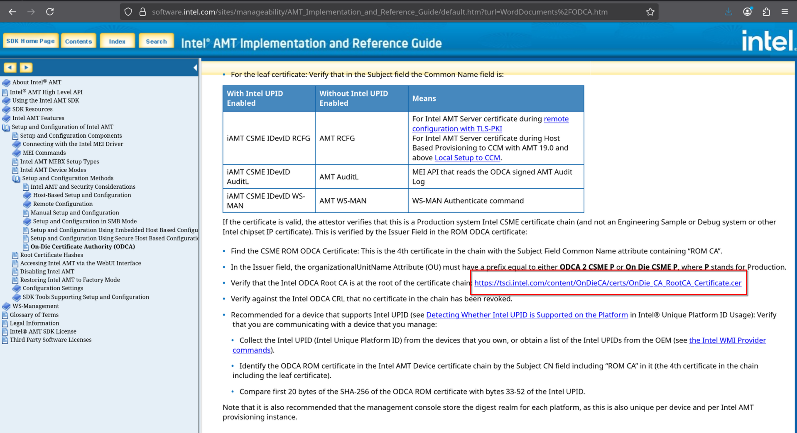

# Intel (INTC)

## Certificate Inventory

| Certificate Name | Type | Source | Does the source reference a fingerprint? |
|------------------|------|--------|:----------------------------------------:|
| OnDie CA RootCA | Root | Intel AMT Implementation and Reference Guide | No |
| ODCA CA2 CSME | Intermediate | AIA extraction from intermediate certificates from Microsoft TPM bundle | No |
| ODCA CA2 OSSE | Intermediate | AIA extraction from intermediate certificates from Microsoft TPM bundle | No |
| ODCA 2 CSME P_ADL 00002820 | Intermediate | AIA extraction from TPM certificate chain on Intel hardware | Yes |

### Source Information

The certificate details were retrieved from Intel's official documentation:
- **Web Page**: https://software.intel.com/sites/manageability/AMT_Implementation_and_Reference_Guide/default.htm?turl=WordDocuments%2FODCA.htm
- **Screenshot Reference**: 


The documentation references the Intel ODCA (On-Die Certificate Authority) Root CA certificate, which is used to verify Intel AMT certificates.

## Discovery Process

### ODCA CA2 CSME

**Discovery Method**:
1. Retrieved the certificate bundle maintained by Microsoft ([available here](https://learn.microsoft.com/en-us/windows-server/security/guarded-fabric-shielded-vm/guarded-fabric-install-trusted-tpm-root-certificates))
2. Selected an intermediate certificate issued by Intel from the bundle
3. Extracted the Authority Information Access (AIA) extension from the intermediate certificate
4. The AIA extension contained a URL pointing to the intermediate certificate: `https://tsci.intel.com/content/OnDieCA/certs/ODCA_CA2_CSME_Intermediate.cer`
5. Downloaded the certificate from the AIA URL

Since the domain **tsci.intel.com** is owned by Intel Corporation, we can reasonably assume this certificate is legitimate.

**Verification**:
You can verify the AIA extraction process yourself using the included intermediate certificate:
```bash
openssl x509 -in src/INTC/ADL_PROD_00002226_ODCA_CA2.cer -inform DER -noout -text | grep -A2 "Authority Information Access"
```
Expected output should contain: `CA Issuers - URI:https://tsci.intel.com/content/OnDieCA/certs/ODCA_CA2_CSME_Intermediate.cer`

### ODCA CA2 OSSE

**Discovery Method**:
1. Retrieved the certificate bundle maintained by Microsoft ([available here](https://learn.microsoft.com/en-us/windows-server/security/guarded-fabric-shielded-vm/guarded-fabric-install-trusted-tpm-root-certificates))
2. Selected an intermediate certificate issued by Intel from the bundle
3. Extracted the Authority Information Access (AIA) extension from the intermediate certificate
4. The AIA extension contained a URL pointing to the intermediate certificate: `https://tsci.intel.com/content/OnDieCA/certs/ODCA_CA2_OSSE_Intermediate.cer`
5. Downloaded the certificate from the AIA URL

Since the domain **tsci.intel.com** is owned by Intel Corporation, we can reasonably assume this certificate is legitimate.

**Verification**:
You can verify the AIA extraction process yourself using the included intermediate certificate:
```bash
openssl x509 -in src/INTC/LNL_00003642_NZ_ODCA_CA2.cer -inform DER -noout -text | grep -A2 "Authority Information Access"
```
Expected output should contain: `CA Issuers - URI:https://tsci.intel.com/content/OnDieCA/certs/ODCA_CA2_OSSE_Intermediate.cer`

### ODCA 2 CSME P_ADL 00002820

**Discovery Method**:
1. Discovered during TPM certificate chain validation on Intel hardware using `tpm-trust` ([issue #18](https://github.com/loicsikidi/tpm-trust/issues/18#issuecomment-4234737203))
2. Extracted the certificate chain from the TPM using `tpm-trust certificate get rsa-2048 --bundle`
3. The fourth certificate in the chain contained an Authority Information Access (AIA) extension
4. The AIA extension referenced the URL: `https://tsci.intel.com/content/OnDieCA/certs/ADL_00002820_ODCA_CA2.cer`
5. Downloaded and validated the certificate from the AIA URL

Since the domain **tsci.intel.com** is owned by Intel Corporation, we can reasonably assume this certificate is legitimate.
