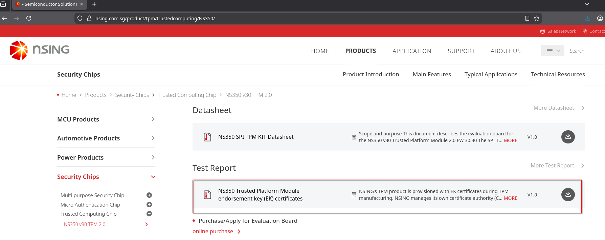

# NSING (NSG)

## Certificate Inventory

| Certificate Name | Type | Source Document | Does the source references a fingerprint? |
|------------------|------|-----------------|:-----------------------------------------:|
| NSING TPM ECC ROOT CA 001 | Root | [NSINGTPMEKcertificatesv1.0.pdf](NSINGTPMEKcertificatesv1.0.pdf) | No |
| NSING TPM RSA ROOT CA 001 | Root | [NSINGTPMEKcertificatesv1.0.pdf](NSINGTPMEKcertificatesv1.0.pdf) | No |
| NSING TPM ECC EK CA 001 | Intermediate | [NSINGTPMEKcertificatesv1.0.pdf](NSINGTPMEKcertificatesv1.0.pdf) | No |
| NSING TPM ECC EK CA 002 | Intermediate | [NSINGTPMEKcertificatesv1.0.pdf](NSINGTPMEKcertificatesv1.0.pdf) | No |
| NSING TPM ECC EK CA 003 | Intermediate | URL Discovery | No |
| NSING TPM ECC EK CA 004 | Intermediate | URL Discovery | No |
| NSING TPM ECC EK CA 005 | Intermediate | URL Discovery | No |
| NSING TPM RSA EK CA 001 | Intermediate | [NSINGTPMEKcertificatesv1.0.pdf](NSINGTPMEKcertificatesv1.0.pdf) | No |
| NSING TPM RSA EK CA 002 | Intermediate | [NSINGTPMEKcertificatesv1.0.pdf](NSINGTPMEKcertificatesv1.0.pdf) | No |
| NSING TPM RSA EK CA 003 | Intermediate | URL Discovery | No |
| NSING TPM RSA EK CA 004 | Intermediate | URL Discovery | No |
| NSING TPM RSA EK CA 005 | Intermediate | URL Discovery | No |

## Source Information

The certificate details were initially retrieved from the official NSING documentation:
- **Web Page**: https://nsing.com.sg/product/tpm/trustedcomputing/NS350/
- **Documentation PDF**: [NSINGTPMEKcertificatesv1.0.pdf](NSINGTPMEKcertificatesv1.0.pdf)
- **Screenshot Reference**: 

> [!NOTE]
> The PDF document has been archived locally as [NSINGTPMEKcertificatesv1.0.pdf](NSINGTPMEKcertificatesv1.0.pdf) for reference.

## Note

1. **URL Discovery**: The PDF documentation only references intermediate CAs 001 and 002. Additional intermediate certificates (003, 004, 005) were discovered by testing incremental URL patterns against the NSING PKI infrastructure at `https://pki.nsing.com.sg/`.
