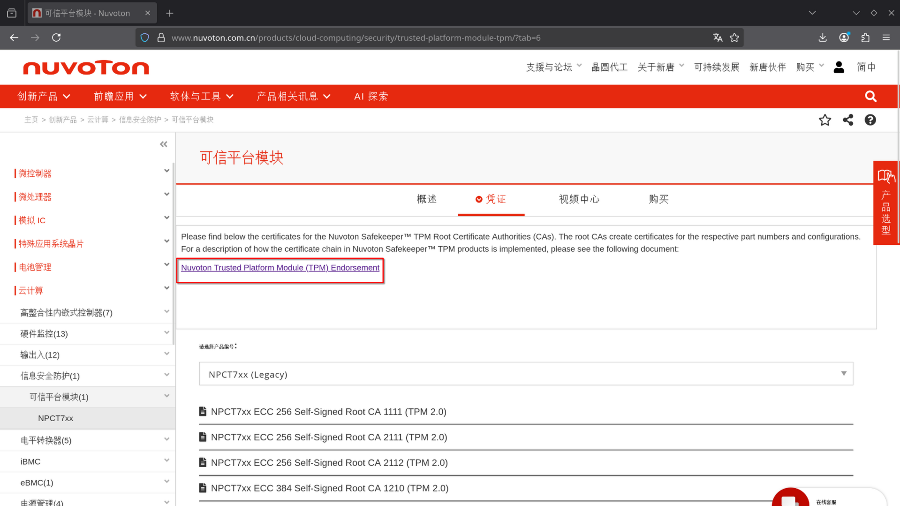

# Nuvoton Technology Corporation (NTC) TPM Root Certificates

## Certificate Inventory

| Certificate Name | Type | Source Document | Does the source references a fingerprint?  |
|------------------|------|-----------------|:------------------------------------------:|
| NPCTxxx ECC521 RootCA | Root | [Nuvoton_TPM_EK_Certificate_Chain_Rev2.2.pdf](Nuvoton_TPM_EK_Certificate_Chain_Rev2.2.pdf) | Yes |
| Nuvoton TPM Root CA 1110 | Root | [Nuvoton_TPM_EK_Certificate_Chain_Rev2.2.pdf](Nuvoton_TPM_EK_Certificate_Chain_Rev2.2.pdf) | Yes |
| Nuvoton TPM Root CA 1111 | Root | [Nuvoton_TPM_EK_Certificate_Chain_Rev2.2.pdf](Nuvoton_TPM_EK_Certificate_Chain_Rev2.2.pdf) | Yes |
| Nuvoton TPM Root CA 2111 | Root | [Nuvoton_TPM_EK_Certificate_Chain_Rev2.2.pdf](Nuvoton_TPM_EK_Certificate_Chain_Rev2.2.pdf) | Yes |
| Nuvoton TPM Root CA 2112 | Root | [Nuvoton_TPM_EK_Certificate_Chain_Rev2.2.pdf](Nuvoton_TPM_EK_Certificate_Chain_Rev2.2.pdf) | Yes |
| NuvotonTPMRootCA1210 | Root | [Nuvoton_TPM_EK_Certificate_Chain_Rev2.2.pdf](Nuvoton_TPM_EK_Certificate_Chain_Rev2.2.pdf) | Yes |
| NuvotonTPMRootCA2210 | Root | [Nuvoton_TPM_EK_Certificate_Chain_Rev2.2.pdf](Nuvoton_TPM_EK_Certificate_Chain_Rev2.2.pdf) | Yes |
| NuvotonTPMRootCA2211 | Root | [Nuvoton_TPM_EK_Certificate_Chain_Rev2.2.pdf](Nuvoton_TPM_EK_Certificate_Chain_Rev2.2.pdf) | Yes |
| NPCTxxx ECC384 LeafCA 012110 | Intermediate | [Nuvoton_TPM_EK_Certificate_Chain_Rev2.2.pdf](Nuvoton_TPM_EK_Certificate_Chain_Rev2.2.pdf) | Yes |
| NPCTxxx ECC384 LeafCA 012111 | Intermediate | [Nuvoton_TPM_EK_Certificate_Chain_Rev2.2.pdf](Nuvoton_TPM_EK_Certificate_Chain_Rev2.2.pdf) | Yes |
| NPCTxxx ECC384 LeafCA 022110 | Intermediate | [Nuvoton_TPM_EK_Certificate_Chain_Rev2.2.pdf](Nuvoton_TPM_EK_Certificate_Chain_Rev2.2.pdf) | Yes |
| NPCTxxx ECC384 LeafCA 022111 | Intermediate | [Nuvoton_TPM_EK_Certificate_Chain_Rev2.2.pdf](Nuvoton_TPM_EK_Certificate_Chain_Rev2.2.pdf) | Yes |

### Source Information

The certificate details were retrieved from the official Nuvoton website:
- **Web Page**: https://www.nuvoton.com.cn/products/cloud-computing/security/trusted-platform-module-tpm/?tab=6
- **Documentation PDF**: https://www.nuvoton.com.cn/export/sites/nuvoton/files/security/Nuvoton_TPM_EK_Certificate_Chain_Rev2.2.pdf
- **Screenshot Reference**: 

> [!NOTE]
> The PDF document has been archived locally as [Nuvoton_TPM_EK_Certificate_Chain_Rev2.2.pdf](Nuvoton_TPM_EK_Certificate_Chain_Rev2.2.pdf) for reference.

### Notes

1. **Fingerprint Correction**: There is a typo on page 6 of the PDF documentation for `NPCTxxx ECC384 LeafCA 022111`. The PDF shows the thumbprint as `97:B6:7D:12:D8:F6:AE:14:24:58:48:45:93:DA:3B:7A:91:D6:46:74`, but the correct value is `E2:12:26:B8:26:A3:81:01:25:4D:E7:90:01:A7:63:33:4D:B5:97:71`. 
