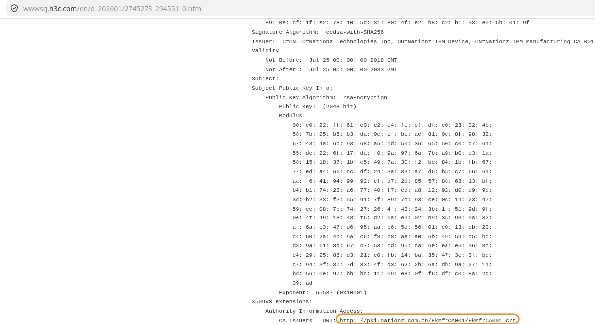

# Nationz Technologies Inc (NTZ)

## Certificate Inventory

| Certificate Name | Type | Source Document | Does the source reference a fingerprint? |
|------------------|------|-----------------|:-----------------------------------------:|
| Nations TPM ECC ROOT CA 001 | Root | AIA extraction from intermediate certificate | No |
| Nations TPM RSA ROOT CA 001 | Root | AIA extraction from intermediate certificate | No |
| Nationz TPM Root CA | Root | AIA extraction from intermediate certificate | No |
| Nations TPM ECC EK CA 001 | Intermediate | Windows bundle | No |
| Nations TPM ECC EK CA 002 | Intermediate | AIA deduction from pattern | No |
| Nations TPM ECC EK CA 003 | Intermediate | AIA deduction from pattern | No |
| Nations TPM ECC EK CA 004 | Intermediate | AIA deduction from pattern | No |
| Nations TPM ECC EK CA 005 | Intermediate | AIA deduction from pattern | No |
| Nations TPM RSA EK CA 001 | Intermediate | Windows bundle | No |
| Nations TPM RSA EK CA 002 | Intermediate | AIA deduction from pattern | No |
| Nations TPM RSA EK CA 003 | Intermediate | AIA deduction from pattern | No |
| Nations TPM RSA EK CA 004 | Intermediate | AIA deduction from pattern | No |
| Nations TPM RSA EK CA 005 | Intermediate | AIA deduction from pattern | No |
| Nationz TPM Manufacturing CA 001 | Intermediate | AIA find on the Web | No |
| Nationz TPM Manufacturing CA 002 | Intermediate | AIA deduction from pattern | No |
| Nationz TPM Manufacturing CA 003 | Intermediate | AIA deduction from pattern | No |

## Discovery Process

### Nations TPM ECC/RSA Certificates

**Discovery Method**:
1. Retrieved the certificate bundle maintained by Microsoft ([available here](https://learn.microsoft.com/en-us/windows-server/security/guarded-fabric-shielded-vm/guarded-fabric-install-trusted-tpm-root-certificates))
2. The bundle contained intermediate certificates: `NSTPMRsaEkCA001.crt` and `NSTPMEccEkCA001.crt` issued by Nations Technologies Inc
3. Extracted the Authority Information Access (AIA) extension from these intermediate certificates to discover their root certificates
4. From the URL patterns observed, deduced the URLs for additional intermediate certificates (002-005)

**Certificate Hierarchies**:

RSA Chain:
- Root: `Nations TPM RSA ROOT CA 001` → https://pki.nationstech.com/NSTPMRsaRootCA001/NSTPMRsaRootCA001.crt
- Intermediates: `Nations TPM RSA EK CA 001-005` → https://pki.nationstech.com/NSTPMRsaEkCA{001-005}/NSTPMRsaEkCA{001-005}.crt

ECC Chain:
- Root: `Nations TPM ECC ROOT CA 001` → https://pki.nationstech.com/NSTPMEccRootCA001/NSTPMEccRootCA001.crt
- Intermediates: `Nations TPM ECC EK CA 001-005` → https://pki.nationstech.com/NSTPMEccEkCA{001-005}/NSTPMEccEkCA{001-005}.crt

Since the domain **pki.nationstech.com** is owned by Nations Technologies Inc, we can reasonably assume these certificates are legitimate.

> [!NOTE]
> Domain ownership verification via WHOIS confirms that both `nationstech.com` and `nationz.com.cn` are registered to the same entity (国民技术股份有限公司 / Nationz Technologies Co., Ltd.) in Guangdong, China, using the same registrar (Alibaba Cloud) and DNS infrastructure (HiChina). This validates the legitimacy of certificates served from both PKI domains.

**Verification**:
You can verify the AIA information yourself using the included intermediate certificates:
```bash
# RSA intermediate
openssl x509 -in src/NTZ/NSTPMRsaEkCA001.crt -inform DER -noout -text | grep -A2 "Authority Information Access"

# ECC intermediate
openssl x509 -in src/NTZ/NSTPMEccEkCA001.crt -inform DER -noout -text | grep -A2 "Authority Information Access"
```

### Nationz TPM Manufacturing CA 001

**Discovery Method**:
1. Retrieved the certificate bundle maintained by Microsoft (i.e. [available here](https://learn.microsoft.com/en-us/windows-server/security/guarded-fabric-shielded-vm/guarded-fabric-install-trusted-tpm-root-certificates))
2. The bundle contained an intermediate certificate named `EkMfrCA001` issued by Nationz Technologies Inc
3. Performed a web search for the keyword "EkMfrCA001"
4. Found H3C support documentation ([available here](https://wwwsg.h3c.com/en/d_202601/2745273_294551_0.htm)) displaying certificate details including the CRL Distribution Point
5. The certificate's Authority Information Access (AIA) extension contained a URL pointing to: `http://pki.nationz.com.cn/EkMfrCA001/EkMfrCA001.crt`
6. Following the same URL pattern, discovered additional certificates: `EkMfrCA002` and `EkMfrCA003`

Since the domain **pki.nationz.com.cn** is owned by Nationz Technologies Inc, we can reasonably assume this certificate is legitimate.

**Verification**:
You can verify the certificate details yourself using the included intermediate certificate:
```bash
openssl x509 -in src/NTZ/EkMfrCA001.crt -noout -text | grep -A2 "Authority Information Access"
```
Expected output should contain: `CA Issuers - URI:http://pki.nationz.com.cn/EkMfrCA001/EkMfrCA001.crt`

#### Source Information

- **Screenshot Reference**: 


### Nationz TPM Root CA

**Discovery Method**:
1. Extracted the Authority Information Access (AIA) extension from *Nationz TPM Manufacturing CA 001* certificate
2. The AIA extension's issuer information pointed to the root certificate: `http://pki.nationz.com.cn/EkRootCA/EkRootCA.crt`

Since the domain **pki.nationz.com.cn** is owned by Nationz Technologies Inc, we can reasonably assume this certificate is legitimate.

**Verification**:
You can verify the issuer information yourself using the included intermediate certificate:
```bash
openssl x509 -in src/NTZ/EkMfrCA001.crt -noout -issuer
```
Expected output: `issuer=C=CN, O=Nationz Technologies Inc, OU=Nationz TPM Device, CN=Nationz TPM Root CA`
