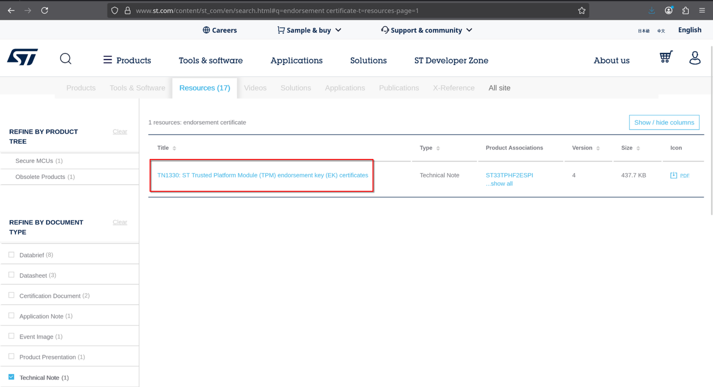

# STMicroelectronics (STM) TPM Certificates

## Certificate Inventory

| Certificate Name | Type | Source Document | Does the source references a fingerprint? |
|------------------|------|-----------------|:-----------------------------------------:|
| GlobalSign Trusted Platform Module ECC Root CA | Root | [en.DM00711714.pdf](en.DM00711714.pdf) | No |
| GlobalSign Trusted Platform Module Root CA | Root | [en.DM00711714.pdf](en.DM00711714.pdf) | No |
| STM TPM ECC Root CA 01 | Root | [en.DM00711714.pdf](en.DM00711714.pdf) | No |
| STM TPM EK Root CA | Root | [en.DM00711714.pdf](en.DM00711714.pdf) | No |
| STSAFE ECC Root CA 02 | Root | [en.DM00711714.pdf](en.DM00711714.pdf) | No |
| STSAFE RSA Root CA 02 | Root | [en.DM00711714.pdf](en.DM00711714.pdf) | No |
| STM TPM ECC Intermediate CA 01 | Intermediate | [en.DM00711714.pdf](en.DM00711714.pdf) | No |
| STM TPM ECC Intermediate CA 02 | Intermediate | [en.DM00711714.pdf](en.DM00711714.pdf) | No |
| STM TPM ECC Intermediate CA 03 | Intermediate | [en.DM00711714.pdf](en.DM00711714.pdf) | No |
| STM TPM ECC384 Intermediate CA 01 | Intermediate | [en.DM00711714.pdf](en.DM00711714.pdf) | No |
| STM TPM ECC384 Intermediate CA 02 | Intermediate | [en.DM00711714.pdf](en.DM00711714.pdf) | No |
| STM TPM ECC384 Intermediate CA 03 for CISCO | Intermediate | [en.DM00711714.pdf](en.DM00711714.pdf) | No |
| STM TPM EK Intermediate CA 01 | Intermediate | [en.DM00711714.pdf](en.DM00711714.pdf) | No |
| STM TPM EK Intermediate CA 02 | Intermediate | [en.DM00711714.pdf](en.DM00711714.pdf) | No |
| STM TPM EK Intermediate CA 03 | Intermediate | [en.DM00711714.pdf](en.DM00711714.pdf) | No |
| STM TPM EK Intermediate CA 04 | Intermediate | [en.DM00711714.pdf](en.DM00711714.pdf) | No |
| STM TPM EK Intermediate CA 05 | Intermediate | [en.DM00711714.pdf](en.DM00711714.pdf) | No |
| STM TPM EK Intermediate CA 06 | Intermediate | [en.DM00711714.pdf](en.DM00711714.pdf) | No |
| STM TPM EK Intermediate CA 07 | Intermediate | [en.DM00711714.pdf](en.DM00711714.pdf) | No |
| STSAFE TPM ECC Intermediate CA 10 | Intermediate | [en.DM00711714.pdf](en.DM00711714.pdf) | No |
| STSAFE TPM ECC Intermediate CA 11 | Intermediate | [en.DM00711714.pdf](en.DM00711714.pdf) | No |
| STSAFE TPM ECC Intermediate CA 20 | Intermediate | [en.DM00711714.pdf](en.DM00711714.pdf) | No |
| STSAFE TPM ECC Intermediate CA 21 | Intermediate | [en.DM00711714.pdf](en.DM00711714.pdf) | No |
| STSAFE TPM RSA Intermediate CA 10 | Intermediate | [en.DM00711714.pdf](en.DM00711714.pdf) | No |
| STSAFE TPM RSA Intermediate CA 11 | Intermediate | [en.DM00711714.pdf](en.DM00711714.pdf) | No |
| STSAFE TPM RSA Intermediate CA 20 | Intermediate | [en.DM00711714.pdf](en.DM00711714.pdf) | No |
| STSAFE TPM RSA Intermediate CA 21 | Intermediate | [en.DM00711714.pdf](en.DM00711714.pdf) | No |

## References

All certificate information and URLs are documented in the official STMicroelectronics TPM documentation.

### Source Information

The certificate details were retrieved from the official STMicroelectronics documentation:
- **Web Page**: https://www.st.com/content/st_com/en/search.html#q=endorsement%20certificate-t=resources-page=1
- **Documentation PDF**: https://www.st.com/content/ccc/resource/technical/document/technical_note/group0/aa/c5/c7/a2/61/9a/4d/13/DM00711714/files/DM00711714.pdf/jcr:content/translations/en.DM00711714.pdf
- **Screenshot Reference**: 

> [!NOTE]
> The PDF document has been archived locally as [en.DM00711714.pdf](en.DM00711714.pdf) for reference.
